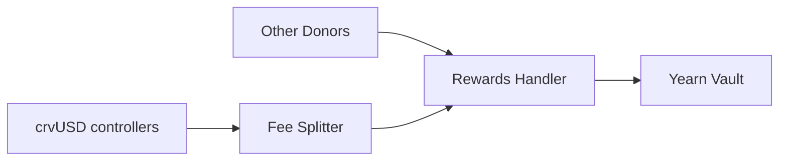

# scrvUSD

Staking vault for crvUSD.

## Vault Implementation Details

The vault is an unmodified instance of a [Yearn v3 multi-strategy vault](https://github.com/yearn/yearn-vaults-v3) that accepts crvUSD deposits.

This vault aims to be as cheap as possible for users to deposit and withdraw funds. For this reason funds deposited in the vault are not moved anywhere and are always available to be redeemed.

Although the vault is called "multi-strategy" it actually doesn't contain any strategies. This is possible thanks to yearn vaults' v3.0.3 ability to [report on self](https://github.com/yearn/yearn-vaults-v3/pull/205).

## Rewards

Rewards in the vault will come from the fees generated by crvUSD controllers. The vault distributes a percentage of the fees through the fee splitter. What percentage of the fees is distributed is determined by Curve's DAO and the vault's [RewardsHandler](contracts/RewardsHandler.vy).

Anyone sending crvUSD to the rewards handler is also effectively donating those funds for distribution to stakers.

## Fee Splitter Interaction and Weight calculation

For the fee splitter to send funds to the rewards handler, the rewards handler must be added as a receiver in the fee splitter by the DAO. Once this condition is met, the fee splitter will send funds to the rewards handler according to what the `weight` function in the rewards handler returns.

The `weight` function allows anyone to take snapshots of the ratio of crvUSD in the vault compared to the circulating supply of crvUSD. This ratio is used to determine the percentage of the fees that can be requested by the fee splitter.

For instance if the time-weighed average of the ratio is 0.1 (10% of the circulating supply is staked), the fee splitter will request 10% of the fees generated by the crvUSD controllers.

---

The percentage of rewards that can be requested from the fee splitter has the following constraints:

$$\text{minimum weight} \leq \text{weight} \leq \text{fee splitter cap}$$

- Upper bounded by whatever percentage cap the fee splitter has. (Controlled by the DAO)
- Lower bounded by the `minimum_weight` parameter in the rewards handler. (Controlled by any `RATE_MANAGER` appointed by the DAO, or the DAO itself)

Furthermore, it can be adjusted at any time by any `RATE_MANAGER` by calling the `set_distribution_time` function in the rewards' handler to prevent manipulation (i.e. MEV on the snapshots).
